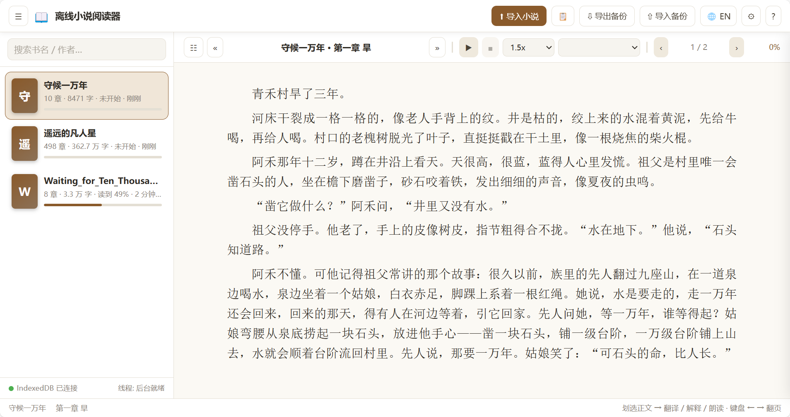

# 📖 Offline Novel Reader (Single-File HTML)

**English** · [简体中文](README.zh.md)

A fully **offline, single-file HTML** novel reader that runs purely in your browser. It stores novels, reading positions and settings in the browser's built-in database (IndexedDB), provides paginated reading, offline bilingual dictionaries (CN⇄EN), text explanation, native text-to-speech, and one-click **backup export / import** so you can migrate your whole library to another device.

No server, no network, no build step needed to use it — just open the file.

<div align="center">
   
</div>

---

## ✨ Features

| Area | What you get |
| --- | --- |
| 📥 Import | `.txt` / `.md`, multi-select, auto **UTF-8 / GBK / Big5** detection; or paste text; duplicate detection (content hash) with "re-import & reset progress" |
| 💾 Persistence | All data auto-saved to **IndexedDB** (refreshing never loses anything); automatic localStorage fallback for restricted browsers |
| 🚚 Migration | **Export backup** → one `.json` (all books + chapters + positions + settings) → **Import backup** on another device (merge or overwrite) |
| 📖 Reading | Measured pagination (`canvas`-based line breaking), page/chapter nav, TOC drawer, jump-by-percent, keyboard & swipe & tap-zone controls, themes (light/sepia/dark/green), font size / line-height / font family / page width settings |
| 🔍 Selection | Select any text → popup bar: **Translate / Explain / Speak / Copy**; optional auto-translate on selection |
| 🌐 Language | Built-in **中文 / English** UI switch (via the **⋯ More** panel in the reading toolbar); follows your browser language the first time, then persists your choice |
| 📚 Offline dictionaries | Bundled into the HTML (5,000 EN→CN + 7,600 CN→EN + 670 Chinese definitions + 188 idioms + 318 character meanings): tabs per dictionary, custom entries you can add/remove |
| 🔊 TTS | Browser-native speech synthesis; continuous page-to-page reading with paragraph highlighting, rate & voice selection, speak-selected-text |
| ⚙️ Extensibility | Modular layered architecture, clear design patterns, Web Worker multithreading, documented data model (see below) |

---

## 🚀 Quick Start

1. Download **`index.html`** (it is the whole application — a single self-contained file, ~190 KB).
2. Double-click it to open in Chrome / Edge / Firefox / Safari (or any modern browser).
3. Click **⬆ 导入小说 (Import)** and pick your `.txt` / `.md` files — reading can start immediately.
4. Everything (books, progress, settings) is saved locally as you read. Refresh the page at any time.

> 💡 Tip: on mobile, keeping `index.html` in your Files app lets you open it directly every time.

---

## 🔁 Migrating to Another Device

**On the old device**

1. Click **⇩ 导出备份 (Export Backup)** — it downloads `novel-reader-backup-<date>.json`.
2. Transfer that file (and that's it — the HTML file is unchanged and reusable).

**On the new device**

1. Open `index.html` there.
2. Click **⇧ 导入备份 (Import Backup)** and pick the `.json`.
3. Choose **Merge** (keep this device's existing books, only add what's missing) or **Overwrite** (recommended for a fresh device — clears local data and restores the backup completely).

All books, chapters, reading positions, settings and custom dictionary entries are restored.

---

## 🔎 Reading

- **Language**: the **⋯ More** panel in the reading toolbar has a **Language** entry that toggles the whole UI between **中文 and English** (titles, buttons, dialogs, dictionary panel, toasts…). On first launch the language follows your browser; afterwards your choice is saved in the settings and travels with the backup.
- **Navigation**: `←` / `→` or `PageUp` / `PageDown` turn pages; `Home` / `End` jump to chapter start/end; on touch devices swipe left/right; the optional **tap zones** on the page edges flip pages; the **☷** button opens the table of contents; the chapter `«` `»` buttons move chapter by chapter.
- **Settings / More** (⚙ / ⋯): theme, font size, line height, font family (serif / kai / sans), page width, TTS rate, tap zones, paragraph indent, selection behavior; low-frequency actions (**Export backup, Import backup, Paste import, Help, Language…**) live in the **⋯ More** panel.
- **Percent** shown at the toolbar right is the whole-book progress; reopening a book always resumes exactly where you left off.

## 🈶 Selection → Translation

Select any text in the reading area; a floating bar offers:

- **翻译 (Translate)** — opens the dictionary panel and translates the selection (English→Chinese or Chinese→English, auto-detected; every matched word/phrase shows its gloss in the dictionary table).
- **朗读 (Speak)** — reads the selection aloud.
- **Copy** — copies to the clipboard.

All of this is **100 % offline** — the dictionaries are embedded in the HTML itself.

### Dictionary panel

- Tabs: **英译中 · 中译英 · 中文释义 · 成语解释 · 汉字详解**.
- Type any text in the input box (or use a selection) and press Enter.
- The **custom entries** section at the bottom persists your own word→meaning pairs (e.g. made-up proper nouns in web novels). They take priority over the built-in dictionaries — a working example of the app's add/delete data operations.

## 🔊 Text-to-Speech

- Uses the browser's native `speechSynthesis` (Windows/macOS/iOS/Android voices; system-dependent).
- ▶ reads continuously from the current page **and turns pages automatically** until the end of the book or ■ stop; the paragraph being read is highlighted; choose rate and voice in the toolbar.
- On browsers without Chinese voices or without speech synthesis at all, the feature degrades gracefully with a hint.

---

## 🧱 Architecture

The single file is compiled from modular sources in [`src/`](src/) (see *Development*). Layering, bottom-up:

| Layer | Module(s) | Responsibility | Pattern |
| --- | --- | --- | --- |
| Utils | `utils` | `$`, `debounce`, hashing, toast, dialogs, progress overlay | Helpers |
| Event bus | `EventBus` | module decoupling | **Observer** |
| Storage | `IndexedDBAdapter` / `LocalStorageAdapter` | abstract CRUD over books/chapters/positions/settings | **Strategy / Repository** |
| Worker | `TextWorker` | chapter segmentation on a **Web Worker** thread (Blob), automatic main-thread fallback | Multithreading |
| Data | `DataManager` | book/chapter/position/settings CRUD, import & dedupe logic | **Facade** over storage |
| Dictionary | `DictionaryService` | multiple offline dictionaries, max-forward-matching segmentation, custom entries | **Strategy** |
| Layout | `LineBreaker` + `ChapterPager` | measured line breaking and pagination (async, non-blocking) | Pure algorithms |
| Reader | `Reader` | navigation, rendering, position save/restore, TTS loop, selection | Controller |
| Backup | `BackupManager` | export / import JSON backup | Serialization |
| App | `App` | assembles everything, binds UI | **Facade** |

**Async programming**: every database operation is promise-based; imports, pagination and file reads never block the UI (progressive rendering, `await`-driven, debounced position saves, `requestAnimationFrame` waits for layout).
**Multithreading**: chapter segmentation runs in a Web Worker (created from a Blob, no extra files); if workers are unavailable the same code runs on the main thread through the same API — the sidebar shows the active mode (`后台就绪` / `主线程`).

### Data model (IndexedDB `novel_reader_db` v1)

| Store | Key | Contents |
| --- | --- | --- |
| `books` | `id` (content-hash-based) | title, source, size, totalChars, chapterChars[], chapterTitles[], percent, timestamps |
| `chapters` | `[bookId, index]` | title + paragraph array per chapter |
| `positions` | `bookId` | chapterIndex, pageIndex, percent, charOffset (+ char-level offset for exact restore) |
| `settings` | `key` | reader settings, TTS rate/voice, custom dictionary, lastBookId… |

Backup file shape: `{ app, appVersion, schema:1, exportedAt, counts, data: { books, chapters, positions, settings } }`.

---

## 🛠 Development

The deliverable is the single file **`index.html`**. Its source lives as readable, commented parts in [`src/`](src/) and is concatenated by a tiny script:

```bash
# rebuild index.html from src/part*.html
node src/concat.js

# syntax-check the extracted inline script
node src/check.js          # (generated by concat)

# run the logic unit tests (794 checks: segmentation, encodings,
# dictionaries, pagination math, CRUD, position round-trip, backup merge/overwrite)
node src/unit-test.js

# static audit: every DOM id referenced by the script exists in the markup
node src/id-audit.js

# optional local static server (default port 8973) for testing over http
node src/server.js
```

> Editing: change the relevant `src/partN.html`, run `node src/concat.js` — `index.html` is regenerated.

### Extending

- **New dictionaries**: add `word|gloss` lines to `RAW_DICTS` (parts 4–5) or register a new dictionary in `DictionaryService.DICTS`.
- **New data (tables/CRUD)**: add stores to both storage adapters, expose methods on `DataManager`, and emit/listen on `EventBus`.
- **New UI features**: components communicate through `EventBus` events (`books:changed`, `reader:page`, `tts:state`, `settings:changed`, …) and the `App` facade wires them together.

---

## 🌐 Compatibility & Notes

- Modern browsers (Chrome / Edge / Firefox / Safari 12.1+). IndexedDB is used when available; browsers that lock it down (e.g. some Private modes) get an automatic localStorage fallback with a size warning.
- TTS voices depend on the OS and store location for Chinese; Chrome/Edge/Safari generally provide `zh-CN` voices.
- Very large books live entirely in local storage; backups JSON-encode everything, so extremely big libraries produce proportionally large files (normal for full offline migration).
- If IndexedDB or localStorage is completely unavailable the app reports the error and explains why.

## 📄 License

Free to use and modify.
